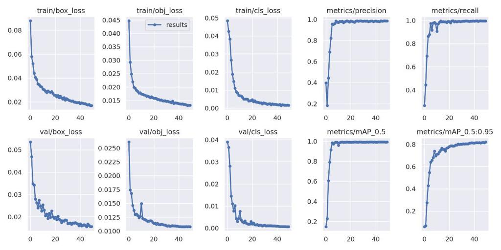

# Inter IIT Tech Meet 11.0
*Team ID: 17*

### Introduction:
Monitoring vitals is an important aspect of providing high-quality care to patients. With the increasing use of technology in healthcare, there are now many digital monitoring systems available that can help to automate the process of tracking vitals, making it more efficient and accurate.

This challenge is aimed at extracting a patient's vitals like SpO2, RR, Systolic Blood Pressure, Diastolic Blood Pressure and MAP from the provided ECG monitor images. We have dealt with this problem in a sequence of three separate subproblems - extracting the screen from the initial image, performing object detection and recognising the text to obtain vitals. We have employed state of the art models, data augmentation techniques, noise reduction models on images, supervised and semi-supervised learning on the data given to obtain a fast and accurate network that takes in an image and outputs the patient's vitals.

### Approach:
We have attempted to solve this problem statement by dividing the core task into several sub tasks and targeting each part as a standalone problem. Our baseline model consists of the following steps :

- **Screen Extraction** - Extracting only the relevant part of the image i.e the monitor. We experimented with several techniques and finally settled with YOLOv5m6.

- **Object Detection to extract vitals** - After experimenting with several architectures we used YOLOv5m6 to identify which number on the screen corresponded to which vital.

- **Character Recognition to obtain measurements** - With the help of Optical Character Recognition(OCR), we read the text contained within the bounding boxes given as output by YOLO.

The above 3 steps lay down the most basic approach we had. Along with this we have later **mentioned our approach for detecting the H.R graph** and digitizing it.

### Dataset :
The dataset we obtained was in three parts:

- **Monitor Segmentation Dataset** - The dataset consists of 2000 images having the segmentation boundaries for the monitors in each image .

- **Classification Dataset** - The second dataset consists of a 1000 monitor images with each monitor belonging to one of the four classes present.

- **Unlabelled Dataset** - The third dataset consists of 7000 unlabelled images with monitors from several different types of classes.

### Baseline Model  :
We train a baseline model to extract the measurements relating to each vital from the monitor image. Our **baseline model** consists of:

- A **ResNet-18** based regressor to obtain the coordinates of the monitors' corners (i.e. to generate a bounding box)

- Followed by **ResNet-18** to perform classification and determine the monitor type.

- This is followed by object detection using **YOLOv5m6** to create bounding boxes around the different vital measurements like Heart Rate, SpO2, RR, MAP etc.

- Finally **Paddle-Paddle OCR** reads the text inside the bounding boxes generated by YOLO and gives the final output.

### Improvements on the Baseline:
We undertook thorough literature reviews and conducted several experiments on our initial baseline by eliminating and adding parts,trying out different models for the subtasks and performing semi-supervised learning. Finally we settled on the following architecture as it gave the best performance.

### Final architecture:
- Screen Extraction via YOLOv5m6
- Vital Sign extraction using YOLOv5m6
- Text recognition using Paddle-Paddle OCR.

### Why did we omit classification?
Since the labeled data given to us was classified into 4 types, we naturally thought of using a CNN based classifier like ResNet to determine the image type and then training a separate YOLO network on each type for higher accuracy. However, since YOLO learns contextual information, it was able to detect the correct vitals irrespective of the monitor type and removal of the classifier lead to a significant decrease in latency while not affecting the accuracy negatively in any way.

### Pipeline :

### Screen Extraction:

- Our first approach to solve this problem was using ResNet-50 to predict the 4 corner points of the quadrilateral tracing the monitor by regression. However, the results were highly inaccurate on unseen data which led us to try out Instance Segmentation of the image by using Mask-RCNN.
 
- Mask-RCNN outputs a bounding box around the monitor along with a pixel by pixel mask. The results after performing semi-supervised learning on the given data were highly accurate. The main issue we faced was an unusually high inference time per image(9 seconds when using Google Colab-CPU).
 
- **YOLO** is extremely fast because it does not deal with complex pipelines. It sees the entire image during training and test time so it implicitly encodes contextual information about classes as well as their appearance. Thus we performed training with YOLOv5m6 and got highly accurate results with a significant improvement in the inference time - **0.6 seconds approximately per image** , 1500% faster than Mask-RCNN.

- We use **YOLOv5 – YOLOv5m6** pretrained on the COCO dataset.

For improving accuracy and a more robust screen extraction, we employ **data augmentations** to learn the given images better.
- We use vertical and horizontal flipping of the images
 
- Changing the image saturation(between -25% and 25%).

- We use Gaussian Blur to blur the images to 6px and also add random noise to 5% of pixels.

### YOLO's outputs for screen segmentation.

### Object detection/extracting vitals :
- Our first approach to solve this problem was exploring the different operations available and performing literature reviews of the said options. We read up about FasterRCNN, ResNet and YOLO and tried to understand how these models would analyze our data.

- After thorough reading and reasoning, we chose YOLO to extract vital signs because YOLO can learn contextual information better than other object detection models.It also has the obvious advantages of better speed and accuracy.

### Semi Supervised Learning :
- We were given a small labeled dataset of 1000 images and unlabelled dataset with 7000 images. Thus the most natural thing to do was to carry out semi-supervised learning of YOLO on both the datasets. We chose **Pseudo-Labelling** , a very simple approach to semi supervised learning.

- The model is initially trained on the labeled dataset and is used to make predictions for the unlabeled data. It selects the examples from the unlabeled dataset where the prediction is confident and considers its prediction as pseudo-label. This pseudo labeled dataset is then added to the labeled dataset and the model is then trained again on the expanded labeled dataset.

- We developed a function to manipulate our text files such that we chose only the most confident predictions of each class. We then concatenated these predicted labels to the original dataset and retrained our network thereby implementing SSL with pseudo labeling.

### Extracting Vital Signs using YOLOv5m6

### Text extraction:
- Once the outputs from YOLO are obtained, the only task left is to recognize the numbers within the bounding boxes.

- We first implemented EasyOCR, a built-in python library which gave quite unsatisfactory results, so we trained and tested TesseractOCR. The problem with Tesseract is that it has too many modes,making it difficult to identify small and blurry text.

- **PaddlePaddle** has many benefits over the other architectures mentioned above. PaddlePaddle OCR has state-of-the-art recognition accuracy. It works better than Tesseract when images are in RGB **/** BGR if the image cannot be binarised.It is based on the PaddlePaddle Platform, which is extremely fast and makes our model useful for real time application.

- We first convert the RGB image to Grayscale. To adjust for very small bounding boxes generated by YOLO during Vital Sign Extraction, we added a padding of 50 pixels. This made it possible for PaddlePaddleOCR to detect the text easily.

### H.R Curve Detection and Digitisation :
- The task of extracting the curve from the image surprisingly turned out to be more complicated than anticipated. The bounding boxes for the HR graphs contain a lot of text on and around the actual curve making it pretty hard to extract out only the curve.

- Performing edge detection and contour tracing on the image did not give satisfactory results.

- We then tried to devise an **algorithm** : a kernel would scan the surrounding pixels to the right and follow the direction of the highest intensity pixels, thus essentially scanning a single pixel thick heart rate curve. However, this algorithm had too big of a time complexity to be used in real time and the problem of overlapping text and discontinuity in the curve made the problem too complex.

- **Finally** we built a network that consists of a noise reducing-network followed by a series of steps to convert the image of the curve to a plot.

1. First we train a YOLOv5s model to learn any noise in the image. For this we manually annotated the H.R. curves with bounding boxes containing any noise near the curve .

2. We use the predictions by the aforementioned YOLO network to remove the garbage portions of the image(noise and unnecessary text) by blacking out all the predicted bounding boxes(changing pixel values to 0).

3. We then binarize the image, and use contour plotting.

4. Finally we sample the obtained image to get a series of points that is displayed as a plot.

### Hyperparameters:

**Yolov5** :

- Adam optimiser with a weight decay of 0.0005 and momentum of 0.937.
- initial learning rate of 0.01 and final OneCycleLR learning rate of 0.01.
- We used the cosine LR scheduler with maximum learning rate set to the initial learning rate of 0.01 and T\_max set to 50.
- Our batch size was 32 for the entire pipeline.

# Results
   

   
| **Technique** | **Accuracy (in %)** | **Inference time per image (in seconds)** |
| --- | --- | --- |
| Screen Extraction with Mask-RCNN → single YOLOv5 network for vitals  | 90.21 | 11.57  |
| **Screen Extraction with YOLOv5m6 → 2 separate YOLOv5 networks for vitals** | **93.723** | **2.26**  |
 
Our final pipeline gave a 93.723% accuracy when tested on a randomly chosen set of 1000 images from the given unlabelled dataset, which was manually annotated. The model had an aveVECe inference time of 2.26 seconds per image(a 412% increase in speed from the Mask-RCNN based pipeline) 

## References:
[Mask -RCNN](https://arxiv.org/abs/1703.06870)
   
[YOLO](https://arxiv.org/abs/1506.02640)
   
[PaddlePaddle OCR](https://arxiv.org/abs/2009.09941)
   
[Resnet](https://arxiv.org/abs/1512.03385)
   
[An Overview of Deep Semi-Supervised Learning](https://arxiv.org/abs/2006.05278)
